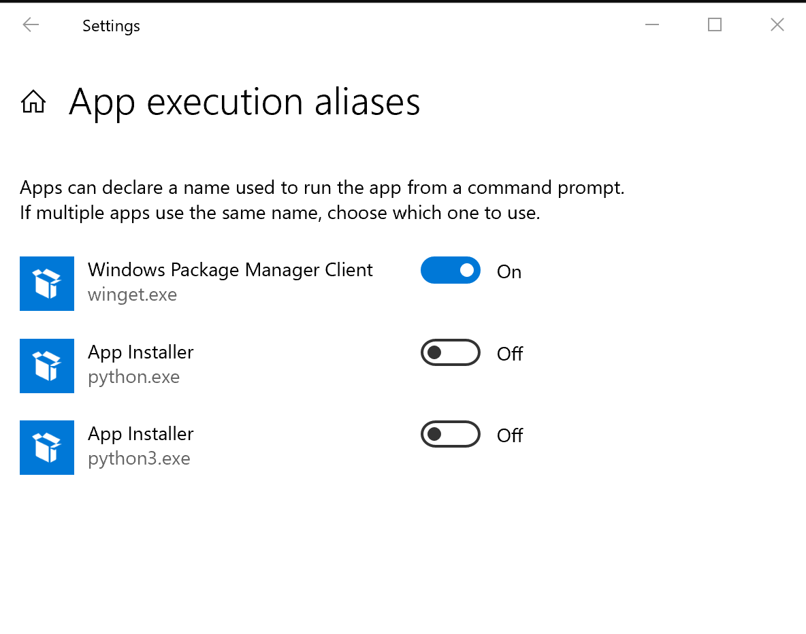

# Reports Creation

Suite of report creation tools created using python and leveraging additional libraries such as pandas and reportlab.
Reports are generated by Federal Electoral District (FED) and describe various aspects of the given FED. 

## Report Types and Descriptions

The following reports can be created using this tool:

|             Report Name             | Abbreviation | Description                                                                                                                                                                                                                                                                                                                                                                                                                                                       |
|:-----------------------------------:|:------------:|-------------------------------------------------------------------------------------------------------------------------------------------------------------------------------------------------------------------------------------------------------------------------------------------------------------------------------------------------------------------------------------------------------------------------------------------------------------------|
|      Polling District Profile       |     PDP      | Lists all PDs in a given FED. Shows PD number, PD name, electors listed and void status. Totals are included at end of report.                                                                                                                                                                                                                                                                                                                                    |
|      Advance Polling Districts      |     APD      | Lists all APDs in a given FED. Shows APD #, APD name, PDs served, total # of PDs in each APD (includes MOBs and SBPDs). Total number of APDs included at end of report                                                                                                                                                                                                                                                                                            |
|        Mobile Polls Summary         |     MPS      | Lists all MOBs in a given FED. Shows PD #s, # of institutions, electors listed, and APD # for each MOB.                                                                                                                                                                                                                                                                                                                                                           |
|            Descriptions             |     PDD      | Lists the PD street segments for each ORD PD, lists each SBPD and MOB in a given FED. Shows PD #, PD name, and CSD name for every PD. ORD PD: Street names, FROM-TO features, FROM-TO civic # ranges, and sides. TRMs are added at the end of affected ORD PDs in the Prairies only. SBPDs: Building name and civic address associated with it. MOBs: Institution names, institution addresses, and electors listed. There is a sub-total at the end of each MOB. |
|     Electoral District Poll Key     |     DPK      | Lists every PD street segment for each ORD, SBPD and MOB in a given FED. Each PDSS shows the CSD, street name, the FROM-TO features, the FROM-TO civic # range, side, PD #, and APD #. The PDSS are grouped and ordered by street name, type, direction, and address range, and are sub-grouped by CSD name and type.                                                                                                                                             |
| Communities with Indigenous Peoples |     IDR      | Lists Communities containing Indigenous Peoples in the FED                                                                                                                                                                                                                                                                                                                                                                                                        |

## Environment Setup

### Requirements

This project will require the installation python 3.9 or newer. Package requirements can be found in the requirements.txt
and can be installed using pip or the package manager of your choice. 

Python will need to be called from the command line to test this open a command prompt window and type the command: python
into the box. If the command is not recognized add the folder containing your python.exe file to the path environment variable for your account.
If the python command opens the Windows store type the following into the search bar: "Manage app execution aliases" and turn off the two python
app installers that are listed.

The required additional python packages for this tool are as follows:

- pandas
- reportlab
- oracledb
- click
- openpyxl

### Installation / Setup

Once python is installed or configured the additional libraries required for the project can be installed. We will be 
installing the required packages using pip. Pip a tool that can be accessed from the command line to install and manage 
python packages. It comes preinstalled with python so no additional installations are required to run this tool.

To install the required packages using pip complete the following steps:

1.) Open the command line (cmd) <kbd>⊞ Win</kbd> then type cmd to bring up the cmd window.

2.) To ensure that python is set up correctly type python on the command line and hit enter

3.) Install required packages using the provided requirements.txt using pip:

        pip install -r requirements.txt

   Should an error appear stating that pip need to be updated navigate to the folder containing your python.exe and use 
   the following command to update pip

    python.exe pip install --upgrade pip

### Other Considerations
If running the data download tool access to the corporate database as well as several additional schemas are required.
Please ensure that you have permission to access the corporate database (CDB). This should include read access to the 
SITES_ADMIN schema as well.

## Workflow Creation

In order to run the tools in this repository you will need to create a workflow file. This file will contain key information
the tool needs in order to create the correct reports. Workflow files follow a consistent schema that is outlines below.
Example workflows can also be found in the workflows directory at the root of this repository. These examples files can be
altered as needed by the user. These files are stored as .json files.

### Data Download Workflow File

For the data download tool the format for the workflow JSON can be seen below:

    { "data": [
        {
            "username": your oracle db username,
            "password": your oracle db password,
            "database": connection string for the CDB,
            "sql_path": Path to the required sql file,
            "ed_list": an array of fed numbers to download the data for stored as integers
        }]
    }
Using the above guide a complete workflow for this tool for three feds would look as follows:

    {"data": [
        {   
            "username": "usernme",
            "password": "pwd",
            "database": "db.connect.string",
            "sql_path": "C:\\reports_creation\\sql\\pd_desc.sql",
            "ed_list": [47001, 48001, 24001]
        },{
            "username": "usernme",
            "password": "pwd",
            "database": "db.connect.string",
            "sql_path": "C:\\reports_creation\\sql\\pd_nums.sql",
            "ed_list": [47001, 48001, 24001] 
        },{
            "username": "usernme",
            "password": "pwd",
            "database": "db.connect.string",
            "sql_path": "C:\\reports_creation-Build-PDF-Report\\sql\\ps_add.sql",
            "ed_list": [47001, 48001, 24001]
        },{
            "username": "usernme",
            "password": "pwd",
            "database": "db.connect.string",
            "sql_path": "C:\\reports_creation\\sql\\strm.sql",
            "ed_list": [47001, 48001, 24001]
        }
    ]}

**An important note for file paths: please ensure that the \\ syntax is maintained as \ will result in an error and cause
the script to fail**

The above script would download all data for the three listed FEDs. A copy of this script can be found in the workflows
for the folder but not in a working form as that would contain sensitive information. Care should be taken to protect 
this file once created, and it should not be shared or placed on a shared drive.

### Reports Creation Workflow File

The JSON for the reports creation tool should be formatted as follows:

    {
        "reports": [{
            "type": report abbreviation,
            "feds": an array of all fed numbers to create reports for
            "data": the path to the local csv or xlsx containing the data
        },{
            "type": report abbreviation,
            "feds": an array of all fed numbers to create reports for
            "data": the path to the local csv or xlsx containing the data
    }],
        "export_directory": path to export directory
    }

Using the above guide an example of a valid workflow creating all reports for three feds would look as follows:

    {"reports":[{
          "type": "PDP",
          "feds": [47001, 48001, 24001],
          "data":".\\data\\pd_nums.csv"
          },{
          "type": "APD",
          "feds": [47001, 48001, 24001],
          "data": ".\\data\\pd_nums.csv"
          },{
          "type": "PDD",
          "feds": [47001, 48001, 24001],
          "data": ".\\data\\pd_desc.csv"
          }, {
          "type": "DPK",
          "feds": [47001, 48001, 24001],
          "data": ".\\data\\pd_desc.csv"
          }, {
          "type": "MPS",
          "feds": [47001, 48001, 24001],
          "data": ".\\data\\pd_nums.csv"
          }, {
          "type": "IDR",
          "feds": [47001, 48001, 24001],
          "data": ".\\data\\PDs and Indigenous Communities.xlsx"
      }],
        "export_directory": "J:\\EMRP\\Work\\GAM_Reports"
    }

**An important note for file paths: please ensure that the \\ syntax is maintained as \ will result in an error and cause
the script to fail**

The above file can be found in workflows folder at the root of this repository and is meant to serve as a reference when 
creating other workflows. It can be altered as needed. 

The above script would create reports of every type for each of the three FED's listed in the array (47001, 48001, and 24001) 
Only the report types being generated need an array unneeded report types can be removed from the workflow.

### Zip Outputs

The JSON for the reports creation tool should be formatted as follows:

    {
      "map_dir": path to the directory containg unsorted map series PDFs,
      "report_dir": path to the dorectory containing sorted report PDFs from the report creation tool,
      "out_dir": path to the directory that will contain the sorted and zipped outputs
    }

An example of what a complete workflow would look like is found below:
    
    {
      "map_dir": "J:\\MapSeries\\Dump",
      "report_dir": "J:\\EMRP\\Work\\GAM_Reports",
      "out_dir": ".\\test"
    }

The above workflow would sort and zip all the files contained in the both the map and report directories by FED and place
zipped versions of those directories in the out directory. 

## Usage

The tools in this repository are designed to be run from a command line interface (CLI) and running the tool outside of 
this type of interface is not recommended or supported. Please note that when run the tools will overwrite any preexisting
files in their respective output folders. If needing to retain any files for archival purposes please make a copy in another
directory. If exporting files to a directory on a shared drive ensure that none of the files you are replacing are open 
by other users as this will cause the tool to fail. 

At this time there are two tools in available for use:

- Data Download: Downloads the data for the reports from the CDB
- Report Creation: Creates the requested reports using the data from the data download tool

As the output of the data download tool is used by the report creation tool it is recommended that the 

### Data Download

This tool is responsible for downloading the data from the databases and into local csv files for the reports creation
tool. This tool must be run on a production machine, so it can access the database. Ensure that you have been granted 
all necessary permissions to databases and schemas before running the tool. 

There are a number of SQL queries available for the tool to run. They can be found in the folder called sql at the root
of this repository. Each SQL query downloads the data needed for certain reports. To check what data is required for each
report refer to the table in the report creation tool instructions.

| SQL Query Name | CSV File Name |
|:--------------:|:-------------:|
|  pd_nums.sql   |  pd_nums.csv  |
|  pd_desc.sql   |  pd_desc.csv  |
|    strm.sql    |   strm.csv    |
|   ps_add.sql   |  ps_add.csv   |

The csv files produced above contain all the information necessary to create every report except for the Communities with
Indigenous Peoples report which requires the PDs and Indigenous Communities.xlsx file which is not one of the files produced
by this tool and must be retrieved from a location TBD.

To run the tool please follow these steps:

1.) Open the cmd window (<kbd>⊞ Win</kbd> then type cmd)

2.) Navigate to the root directory of this repository. The recommended path for this is c:\\reports_creation to keep the
    path as short as possible.

3.) Activate the tool by creating a command using the following formula: 
        
    python <tool name .py> <path to workflow>

An example of a valid command for the data download tool using a workflow file called download_workflow.json which is located
in the workflows folder of this repository would look as follows:

    python data_download.py .\\workflows\\download_workflow.json

4.) Once the command is constructed hit <kbd>⏎ Enter</kbd> to run it.

5.) If the command was valid the tool will run. While running the tool will produce a series of messages to give you an update
on what is processing as well as a timestamp for when that process started. There are three types of messages that can
appear in the console:

- INFO: Informational messages on the current action the tool is performing
- WARNING: Something occurred that was outside the normal parameters of the tool but did not inhibit processing. An
  example of the common warning for this tool is No data available for the specified FED.
- ERROR: Something occurred that was significant enough to inhibit processing.

#### Outputs

This tool creates the following outputs:

1.) CSV file(s) containing data for the feds specified in the workflow. These are located in the data folder at the root
    of this directory (this location cannot be changed)
2.) A log file containing all the messages that were printed to the cmd window. This serves as a record of the process and
    allows the user to check for errors after processing. This file will be located in the logs folder at the root of
    this repository and all log files will use this naming convention: <date_of_processing>.log with the date following 
    the YYYY-MM-DD convention. 

### Report Creation

This tool is responsible for creating the reports and exporting them to a given directory. This tool should always be run
after the data download tool as without data no reports will be produced.

Each report requires certain datasets to be present in the data folder in order for the report to be produced. The table
below shows the report and the required datasets (as a csv). Ensure that the data is present for the specific FED's needed
as the data is  as per the data download tool at any one time.

|               Report                | Abbreviation |          Required Datasets          |
|:-----------------------------------:|:------------:|:-----------------------------------:|
|      Polling District Profile       |     PDP      |             pd_nums.csv             |
|      Advance Polling Districts      |     APD      |             pd_nums.csv             |
|        Mobile Polls Summary         |     MPS      |             pd_nums.csv             |
|            Descriptions             |     PDD      |  pd_desc.csv, strm.csv, ps_add.csv  |
|     Electoral District Poll Key     |     DPK      |             pd_desc.csv             |
| Communities with Indigenous Peoples |     IDR      | PDs and Indigenous Communities.xlsx |

To run the reports creation tool follow the following steps:

1.) Open the command line and use the cd command to navigate to the root folder of this directory.

2.) Type a valid command to run the tool using the following formula:
        
    python <tool_name.py> <path_to_workflow.json>
    
- python refers to the python environment the project requirements were installed with. Should this keyword not work
      you can replace it with the path to the python.exe file associated with your desired environment.
- <tool_name.py> refers to the name of the python file you want to run. These files can be found in this projects 
  root folder. 
- <path_to_workflow.json> this refers to a path to the workflow json file described in the prior section. 

For example to run the report creation tool using a workflow json called example would produce a command that looks like this:

    python report_creation.py .\\workflows\\example.json
    
3.) Once the command is created hit <kbd>⏎ Enter</kbd> to run it.

4.) If the command was valid the tool will run. While running the tool will produce a series of messages to give you an update
on what is processing as well as a timestamp for when that process started. There are three types of messages that can
appear in the console:

- INFO: Informational messages on the current action the tool is performing
- WARNING: Something occurred that was outside the normal parameters of the tool but did not inhibit processing. An
  example of the common warning for this tool is No data available for the specified FED.
- ERROR: Something occurred that was significant enough to inhibit processing.

Another method that can be used is to create a .bat file containing the above command. This can be used to chain several
workflows together as needed. An example .bat file called 'example.bat' can be found in the workflows folder as a guide 
for creating your own custom .bat files.

The pdf files produced by this tool will be output in a folder called 'scratch' in the root folder of this repository.
From there they are exported to the directory specified by the export_directory parameter in the workflow file. Once 
production of all reports is complete the script will export all pdf files in the scratch directory to the directory 
specified in the 'export_directory' parameter in the workflow file. Note that the scratch directory gets deleted everytime 
the script is run. The tool will overwrite existing versions of a report if a new one is generated.

#### Outputs

1.) PDF and XLSX files sorted by fed in the given export directory 
2.) A log file containing all the messages that were printed to the cmd window. This serves as a record of the process and
    allows the user to check for errors after processing. This file will be located in the logs folder at the root of
    this repository and all log files will use this naming convention: <date_of_processing>.log with the date following 
    the YYYY-MM-DD convention. 

### Zip Outputs

This tool is responsible for creating an organized zip file of all the products produced by the map series and report
creation projects. The output of this tool is a .zip file per FED that contains both maps and reports for the consumption
of both internal and external clients. This tool should only be run after all other tools are finished processing as it 
requires all products to be available at runtime. 

This tool will place the produced .zip files in a directory as specified in the workflow .zip. It is imperative that the 
user ensure that none of these files are open BEFORE running the tool as a permission error will cause the tool to fail and
require processing to start over again. 

The process for running this tool is similar to the other tools previously described in this section. Please follow the 
directions below to best use this tool:

1.) Open the cmd window (<kbd>⊞ Win</kbd> then type cmd)

2.) Navigate to the root directory of this repository. The recommended path for this is c:\\reports_creation to keep the
    path as short as possible.

3.) Activate the tool by creating a command using the following formula: 
        
    python <tool name .py> <path to workflow>

An example of a valid command for the data download tool using a workflow file called zip_ex.json which is located
in the workflows folder of this repository would look as follows:

    python zip_output.py .\\workflows\\zip_ex.json

4.) Once the command is constructed hit <kbd>⏎ Enter</kbd> to run it.

5.) If the command was valid the tool will run. While running the tool will produce a series of messages to give you an update
on what is processing as well as a timestamp for when that process started. There are three types of messages that can
appear in the console:

- INFO: Informational messages on the current action the tool is performing
- WARNING: Something occurred that was outside the normal parameters of the tool but did not inhibit processing. An
  example of the common warning for this tool is No data available for the specified FED.
- ERROR: Something occurred that was significant enough to inhibit processing.

#### Outputs

On a successful run of the tool the following outputs will be produced:

1.) A .zip file for each FED that contains all map and report files that were available in the provided directories when
    the tool was run. 
2.) A log file containing all the messages that were printed to the cmd window. This serves as a record of the process and
    allows the user to check for errors after processing. This file will be located in the logs folder at the root of
    this repository and all log files will use this naming convention: <date_of_processing>.log with the date following 
    the YYYY-MM-DD convention.
